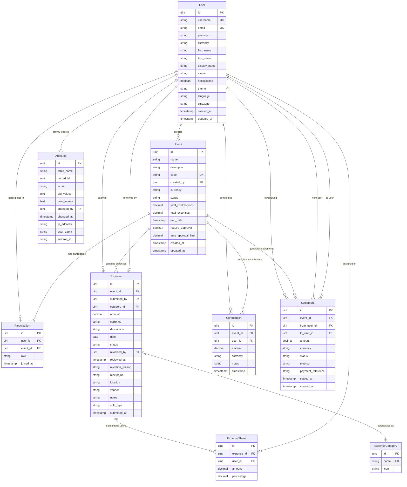

# 🏗️ ExpenseTracker Architecture Documentation

## Table of Contents

1. [System Overview](#system-overview)
2. [Architecture Layers](#architecture-layers)
3. [Data Model](#data-model)
4. [Application Flow](#application-flow)
5. [Deployment Architecture](#deployment-architecture)
6. [Technology Stack](#technology-stack)
7. [Security Architecture](#security-architecture)
8. [Performance Considerations](#performance-considerations)
9. [Scalability Patterns](#scalability-patterns)
10. [Development Guidelines](#development-guidelines)

---

## System Overview

ExpenseTracker is a modern, collaborative expense management application built with a clean layered architecture. The system follows Domain-Driven Design (DDD) principles and implements a RESTful API with real-time capabilities.

### Core Principles

- **Separation of Concerns**: Clear layer boundaries with distinct responsibilities
- **Domain-Driven Design**: Business logic encapsulated in domain services
- **Progressive Web App**: Modern web technologies for native-like experience
- **Real-time Collaboration**: WebSocket-powered live updates
- **Security First**: JWT authentication, input validation, audit trails
- **Cloud-Ready**: Containerized with multiple deployment options

---

## Architecture Layers

The application follows a traditional N-tier architecture with clear separation between presentation, business logic, and data layers:


### Layer Responsibilities

#### 1. Client Layer (Progressive Web App)
- **Progressive Web App**: Modern web technologies providing native-like experience
- **Service Worker**: Offline functionality and intelligent caching
- **Web Manifest**: App installation and home screen integration

#### 2. Presentation Layer (Frontend)
- **Authentication UI**: Login, registration, and profile management
- **Dashboard**: Events overview and quick actions
- **Event Management**: Detailed expense tracking and settlement views
- **Real-time Updates**: WebSocket-powered live collaboration

#### 3. API Gateway Layer (Middleware)
- **Gin Router**: HTTP request routing and WebSocket upgrade handling
- **Authentication**: JWT token validation and user context
- **CORS**: Cross-origin resource sharing configuration
- **Rate Limiting**: Request throttling and abuse prevention
- **Logging**: Structured request/response logging

#### 4. Controller Layer (Request Handlers)
- **AuthController**: User authentication and profile management
- **EventController**: Event creation, management, and participation
- **ExpenseController**: Expense submission, approval, and categorization
- **SettlementController**: Settlement generation and management
- **WebSocketController**: Real-time communication handling

#### 5. Service Layer (Business Logic)
- **SettlementService**: Complex balance calculations and optimization algorithms
- **ValidationService**: Business rule validation and data integrity
- **NotificationService**: Real-time event broadcasting

#### 6. Data Access Layer (ORM)
- **GORM**: Object-relational mapping with PostgreSQL/SQLite support
- **Models**: Strongly-typed data models with relationships

#### 7. Storage Layer
- **SQLite Database**: Lightweight, file-based database for development/small deployments
- **Static Files**: CSS, JavaScript, images, and other assets

#### 8. Infrastructure Layer
- **Docker**: Containerization for consistent deployments
- **Reverse Proxy**: SSL termination and load balancing
- **Backup Services**: Automated database backups and retention

---

## Data Model

The application uses a well-normalized relational data model with proper foreign key relationships and constraints:



### Key Entities

#### Core Entities
- **User**: System users with profiles and preferences
- **Event**: Group expense events (trips, parties, etc.)
- **Participation**: User roles within events
- **Expense**: Individual expense entries
- **Settlement**: Optimized payment transactions

#### Supporting Entities
- **ExpenseShare**: Expense splitting configuration
- **ExpenseCategory**: Predefined expense categories
- **Contribution**: Money contributed to events
- **AuditLog**: Complete activity audit trail

### Data Relationships

1. **User-Event Relationship**: Many-to-many through Participation
2. **Event-Expense Relationship**: One-to-many with cascading operations
3. **Expense-Share Relationship**: One-to-many for flexible splitting
4. **Settlement Optimization**: Calculated from expense shares and contributions

---

## Application Flow

The following sequence diagram illustrates the typical user interaction flow:


### Key Workflows

#### 1. Authentication Flow
- JWT-based stateless authentication
- Secure password hashing with bcrypt
- Token refresh mechanism
- Session management in localStorage

#### 2. Event Management
- Unique event codes for easy joining
- Role-based permissions (owner, admin, participant)
- Real-time participant updates

#### 3. Expense Processing
- Multi-step approval workflow
- Flexible splitting algorithms (equal, percentage, custom)
- Receipt upload and categorization

#### 4. Settlement Optimization
- Complex balance calculation algorithms
- Minimal transaction optimization
- Real-time settlement updates

---

## Deployment Architecture

The application supports multiple deployment strategies from development to enterprise scale:


### Deployment Options

#### Local Development
```bash
# Quick start
go run main.go

# With hot reload
air

# Custom configuration
PORT=3000 JWT_SECRET=dev-secret go run main.go
```

#### Docker Deployment
```bash
# Build and run
docker-compose -f deployment/docker/docker-compose.yml up -d

# With custom environment
JWT_SECRET=production-secret docker-compose up -d
```

#### Cloud Platforms
- **AWS ECS**: Fargate containers with Application Load Balancer
- **DigitalOcean**: App Platform with automatic scaling
- **Railway**: Git-based deployment with automatic HTTPS
- **Fly.io**: Global edge deployment with SQLite replication

---

## Technology Stack

### Backend Technologies
- **Language**: Go 1.21+ with strong typing and concurrency
- **Web Framework**: Gin for high-performance HTTP routing
- **ORM**: GORM for database abstraction and migrations
- **Database**: SQLite for development, PostgreSQL for production
- **Authentication**: JWT tokens with bcrypt password hashing
- **Real-time**: WebSocket for live collaboration

### Frontend Technologies
- **Progressive Web App**: Modern web standards
- **Styling**: Swiss Design system with CSS custom properties
- **JavaScript**: ES6+ with async/await patterns
- **Icons**: Lucide icon library
- **Caching**: Service Worker with Cache API

### Infrastructure Technologies
- **Containerization**: Docker with multi-stage builds
- **Reverse Proxy**: Traefik v2.10 with automatic HTTPS
- **Backups**: Automated SQLite backups with compression
- **Monitoring**: Health checks and structured logging

---

## Security Architecture

### Authentication & Authorization
- **JWT Tokens**: Stateless authentication with 24-hour expiration
- **Password Security**: bcrypt hashing with salt rounds
- **Role-Based Access**: Granular permissions within events
- **Session Management**: Secure token storage and refresh

### Data Protection
- **Input Validation**: Server-side validation for all inputs
- **SQL Injection Prevention**: GORM parameterized queries
- **XSS Protection**: Content Security Policy headers
- **Rate Limiting**: Request throttling per IP address

### Audit & Compliance
- **Audit Trail**: Complete activity logging with user context
- **Data Retention**: Configurable backup retention policies
- **GDPR Compliance**: User data export and deletion capabilities

---

## Performance Considerations

### Database Optimization
- **Indexes**: Strategic indexing on frequently queried columns
- **Query Optimization**: GORM query optimization and eager loading
- **Connection Pooling**: Efficient database connection management

### Caching Strategy
- **Service Worker**: Intelligent client-side caching
- **Static Assets**: Browser caching with cache busting
- **API Responses**: Conditional requests with ETags

### Real-time Performance
- **WebSocket Connections**: Efficient message broadcasting
- **Connection Management**: Automatic reconnection handling
- **Message Queuing**: Buffered updates for offline users

---

## Scalability Patterns

### Horizontal Scaling
- **Stateless Design**: No server-side session storage
- **Load Balancing**: Multiple instance deployment
- **Database Scaling**: Read replicas and connection pooling

### Vertical Scaling
- **Resource Optimization**: Efficient memory and CPU usage
- **Goroutine Management**: Concurrent request handling
- **Database Tuning**: Query optimization and indexing

### Microservices Migration Path
- **Service Extraction**: Settlement service as independent service
- **API Gateway**: Centralized routing and authentication
- **Event-Driven Architecture**: Asynchronous communication patterns

---

## Development Guidelines

### Code Organization
```
├── controllers/          # Request handlers and routing logic
├── middleware/           # Cross-cutting concerns (auth, CORS, logging)
├── models/              # Data models and database schema
├── services/            # Business logic and domain services
├── database/            # Database configuration and migrations
├── static/              # Frontend assets (CSS, JS, images)
├── templates/           # HTML templates
├── deployment/          # Docker and deployment configurations
└── main.go             # Application entry point
```

### Best Practices
- **Error Handling**: Consistent error responses with proper HTTP status codes
- **Testing**: Unit tests for business logic, integration tests for APIs
- **Documentation**: Clear API documentation with examples
- **Logging**: Structured logging with appropriate log levels
- **Configuration**: Environment-based configuration management

### Development Workflow
1. **Local Development**: Use `air` for hot reloading
2. **Testing**: Run tests before committing changes
3. **Code Review**: Peer review for all changes
4. **Deployment**: Automated deployment through CI/CD pipelines

---

## Future Enhancements

### Planned Features
- **Mobile Apps**: React Native or Flutter applications
- **Advanced Analytics**: Expense trends and insights
- **Integration APIs**: Third-party service integrations
- **Multi-tenancy**: Organization-level isolation

### Technical Improvements
- **Microservices**: Service decomposition for better scalability
- **Event Sourcing**: Complete audit trail with event replay
- **GraphQL API**: Flexible data fetching for mobile clients
- **Kubernetes**: Container orchestration for enterprise deployments

---

*This architecture documentation is maintained alongside the codebase and should be updated with any significant architectural changes.*
